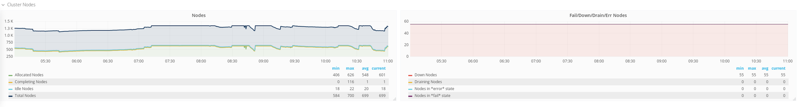
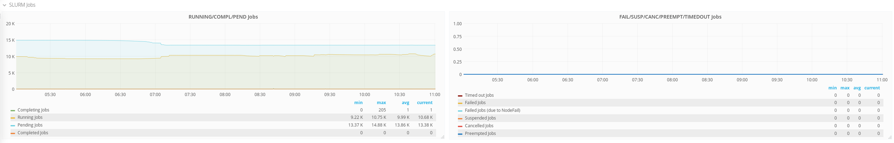
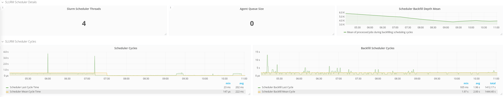

# Prometheus Slurm Exporter

Prometheus collector and exporter for metrics extracted from the [Slurm](https://slurm.schedmd.com/overview.html) resource scheduling system.

## Exported Metrics

### State of the CPUs

* **Allocated**: CPUs which have been allocated to a job.
* **Idle**: CPUs not allocated to a job and thus available for use.
* **Other**: CPUs which are unavailable for use at the moment.
* **Total**: total number of CPUs.

- Information extracted from the SLURM [**sinfo**](https://slurm.schedmd.com/sinfo.html) command.
- [Slurm CPU Management User and Administrator Guide](https://slurm.schedmd.com/cpu_management.html)

### State of the GPUs

* **Allocated**: GPUs which have been allocated to a job.
* **Other**: GPUs which are unavailable for use at the moment.
* **Total**: total number of GPUs.
* **Utilization**: total GPU utiliazation on the cluster.

- Information extracted from the SLURM [**sinfo**](https://slurm.schedmd.com/sinfo.html) and [**sacct**](https://slurm.schedmd.com/sacct.html) command.
- [Slurm GRES scheduling](https://slurm.schedmd.com/gres.html)

**NOTE**: since version **0.19**, GPU accounting has to be **explicitly** enabled adding the _-gpus-acct_ option to the command line otherwise it will not be activated.

Be aware that:

* According to issue #38, users reported that newer version of Slurm provides slightly different output and thus GPUs accounting may not work properly.
* Users who do not have GPUs and/or do not have accounting activated may want to keep GPUs accounting **off** (see issue #45).

### State of the Nodes

* **Allocated**: nodes which has been allocated to one or more jobs.
* **Completing**: all jobs associated with these nodes are in the process of being completed.
* **Down**: nodes which are unavailable for use.
* **Drain**: with this metric two different states are accounted for:
  - nodes in ``drained`` state (marked unavailable for use per system administrator request)
  - nodes in ``draining`` state (currently executing jobs but which will not be allocated for new ones).
* **Fail**: these nodes are expected to fail soon and are unavailable for use per system administrator request.
* **Error**: nodes which are currently in an error state and not capable of running any jobs.
* **Idle**: nodes not allocated to any jobs and thus available for use.
* **Maint**: nodes which are currently marked with the __maintenance__ flag.
* **Mixed**: nodes which have some of their CPUs ALLOCATED while others are IDLE.
* **Resv**: these nodes are in an advanced reservation and not generally available.

- Information extracted from the SLURM [**sinfo**](https://slurm.schedmd.com/sinfo.html) command.

#### Additional info about node usage

Since version **0.18**, the following information are also extracted and exported for **every** node known by Slurm:

* CPUs: how many are _allocated_, _idle_, _other_ and in _total_.
* Memory: _allocated_ and in _total_.
* Labels: hostname and its Slurm status (e.g. _idle_, _mix_, _allocated_, _draining_, etc.).

See the related [test data](https://github.com/vpenso/prometheus-slurm-exporter/blob/master/test_data/sinfo_mem.txt) to check the format of the information extracted from Slurm.

### Status of the Jobs

* **PENDING**: Jobs awaiting for resource allocation.
* **PENDING_DEPENDENCY**: Jobs awaiting because of an unexecuted job dependency.
* **RUNNING**: Jobs currently allocated.
* **SUSPENDED**: Job has an allocation but execution has been suspended and CPUs have been released for other jobs.
* **CANCELLED**: Jobs which were explicitly cancelled by the user or system administrator.
* **COMPLETING**: Jobs which are in the process of being completed.
* **COMPLETED**: Jobs have terminated all processes on all nodes with an exit code of zero.
* **CONFIGURING**: Jobs have been allocated resources, but are waiting for them to become ready for use.
* **FAILED**: Jobs terminated with a non-zero exit code or other failure condition.
* **TIMEOUT**: Jobs terminated upon reaching their time limit.
* **PREEMPTED**: Jobs terminated due to preemption.
* **NODE_FAIL**: Jobs terminated due to failure of one or more allocated nodes.

- Information extracted from the SLURM [**squeue**](https://slurm.schedmd.com/squeue.html) command.

### State of the Partitions

* Running/suspended Jobs per partitions, divided between Slurm accounts and users.
* CPUs total/allocated/idle per partition plus used CPU per user ID.

### Jobs information per Account and User

The following information about jobs are also extracted via [squeue](https://slurm.schedmd.com/squeue.html):

* **Running/Pending/Suspended** jobs per SLURM Account.
* **Running/Pending/Suspended** jobs per SLURM User.

### Scheduler Information

* **Server Thread count**: The number of current active ``slurmctld`` threads.
* **Queue size**: The length of the scheduler queue.
* **DBD Agent queue size**: The length of the message queue for _SlurmDBD_.
* **Last cycle**: Time in microseconds for last scheduling cycle.
* **Mean cycle**: Mean of scheduling cycles since last reset.
* **Cycles per minute**: Counter of scheduling executions per minute.
* **(Backfill) Last cycle**: Time in microseconds of last backfilling cycle.
* **(Backfill) Mean cycle**: Mean of backfilling scheduling cycles in microseconds since last reset.
* **(Backfill) Depth mean**: Mean of processed jobs during backfilling scheduling cycles since last reset.
* **(Backfill) Total Backfilled Jobs** (since last slurm start): number of jobs started thanks to backfilling since last Slurm start.
* **(Backfill) Total Backfilled Jobs** (since last stats cycle start): number of jobs started thanks to backfilling since last time stats where reset.
* **(Backfill) Total backfilled heterogeneous Job components**: number of heterogeneous job components started thanks to backfilling since last Slurm start.

- Information extracted from the SLURM [**sdiag**](https://slurm.schedmd.com/sdiag.html) command.

*DBD Agent queue size*: it is particularly important to keep track of it, since an increasing number of messages
counted with this parameter almost always indicates three issues:
* the _SlurmDBD_ daemon is down;
* the database is either down or unreachable;
* the status of the Slurm accounting DB may be inconsistent (e.g. ``sreport`` missing data, weird utilization of the cluster, etc.).

### Share Information

Collect _share_ statistics for every Slurm account. Refer to the [manpage of the sshare command](https://slurm.schedmd.com/sshare.html) to get more information.

## Installation

* Read [DEVELOPMENT.md](DEVELOPMENT.md) in order to build the Prometheus Slurm Exporter. After a successful build copy the executable
`bin/prometheus-slurm-exporter` to a node with access to the Slurm command-line interface.

* A [Systemd Unit][sdu] file to run the executable as service is available in [lib/systemd/prometheus-slurm-exporter.service](lib/systemd/prometheus-slurm-exporter.service).

* (**optional**) Distribute the exporter as a Snap package: consult the [following document](packages/snap/README.md). **NOTE**: this method requires the use of [Snap](https://snapcraft.io), which is built by [Canonical](https://canonical.com).

[sdu]: https://www.freedesktop.org/software/systemd/man/systemd.service.html

## Prometheus Configuration for the SLURM exporter

It is strongly advisable to configure the Prometheus server with the following parameters:

```
scrape_configs:

#
# SLURM resource manager:
#
  - job_name: 'my_slurm_exporter'

    scrape_interval:  30s

    scrape_timeout:   30s

    static_configs:
      - targets: ['slurm_host.fqdn:8080']
```

* **scrape_interval**: a 30 seconds interval will avoid possible 'overloading' on the SLURM master due to frequent calls of sdiag/squeue/sinfo commands through the exporter.
* **scrape_timeout**: on a busy SLURM master a too short scraping timeout will abort the communication from the Prometheus server toward the exporter, thus generating a ``context_deadline_exceeded`` error.

The previous configuration file can be immediately used with a fresh installation of Prometheus. At the same time, we highly recommend to include at least the ``global`` section into the configuration. Official documentation about __configuring Prometheus__ is [available here](https://prometheus.io/docs/prometheus/latest/configuration/configuration/).

**NOTE**: the Prometheus server is using __YAML__ as format for its configuration file, thus **indentation** is really important. Before reloading the Prometheus server it would be better to check the syntax:

```
$~ promtool check-config prometheus.yml

Checking prometheus.yml
  SUCCESS: 1 rule files found
[...]
```

## Grafana Dashboard

A [dashboard](https://grafana.com/dashboards/4323) is available in order to
visualize the exported metrics through [Grafana](https://grafana.com):








## License

Copyright 2017-2020 Victor Penso, Matteo Dessalvi

This is free software: you can redistribute it and/or modify it under the terms of the GNU General Public License as published by the Free Software Foundation, either version 3 of the License, or (at your option) any later version.

This program is distributed in the hope that it will be useful, but WITHOUT ANY WARRANTY; without even the implied warranty of MERCHANTABILITY or FITNESS FOR A PARTICULAR PURPOSE. See the GNU General Public License for more details.

You should have received a copy of the GNU General Public License along with this program. If not, see http://www.gnu.org/licenses/.
